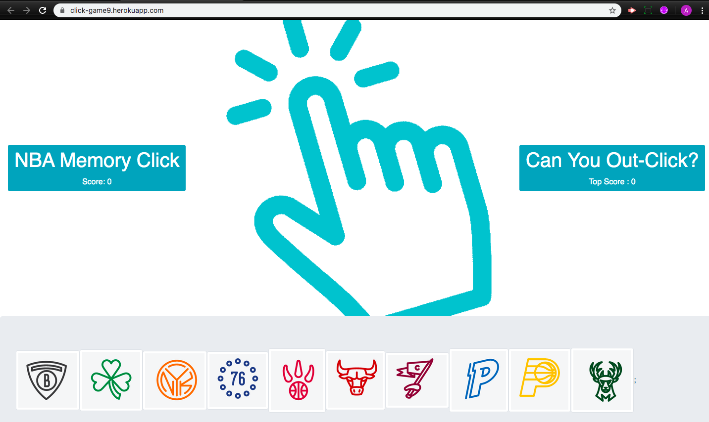

# NBA Memory Click

 

## Description

NBA Memory Click is a game designed to test the memory of the user using popular NBA Teams. The user clicks an image without repeating any clicks. Logos are shuffled between clicks to make the game more challenging. The top score of the users session is displayed and replaced when beaten.

 

## Run Instructions

Logos at the bottom of the page can be clicked on to improve score until duplicate reached:

## This App Utilizes

- [ReactJS](https://reactjs.org/)

 

## Role in Development

My name is Alex I am a bootcamp student whose portfolio can be found
[here](https://alexsamalot19.github.io/Samalot-Alexander-Portfolio/).

I designed this app using existing APIs and packages listed in the **This App Utilizes** section. I used Node and Sequelize to query and route data in this app, and Handlebars to generate your HTML. The site is deployed to Heroku [here](https://click-game9.herokuapp.com/).
